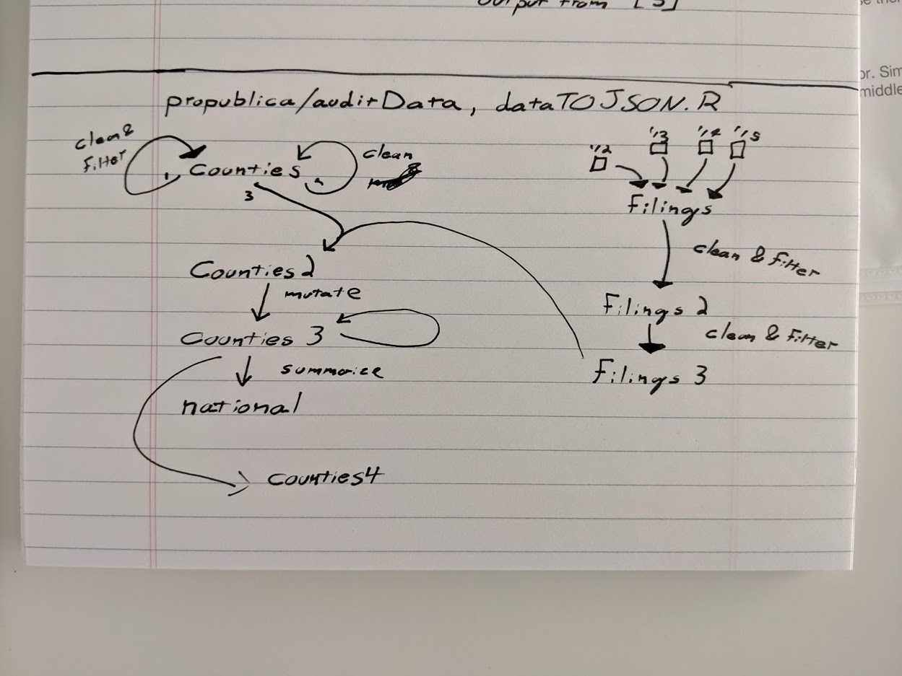

# IRS Audit Rates by County

This repo contains the data and scripts behind ["Where in The U.S. Are You Most Likely to Be Audited by the IRS?"](https://projects.propublica.org/graphics/eitc-audit) published April 1, 2019.

## Steve's Notes

This R script combines data on the number of tax return audits with the number of tax returns filed. 

## About

The earned income tax credit, or EITC, is a program designed to help boost low-income workers out of poverty. In response to pressure from congressional Republicans to root out incorrect payments of the credit, the IRS audits EITC recipients at [higher rates than all but the richest Americans](https://www.propublica.org/article/earned-income-tax-credit-irs-audit-working-poor).

Kim M. Bloomquist, who served as a senior economist with the IRS’ research division for two decades, decided to map the distribution of audits to illustrate the dramatic regional effects of the agency's emphasis on EITC recipients. In a study first published in [Tax Notes](https://www.taxnotes.com/tax-notes-today/audits/regional-bias-irs-audit-selection/2019/03/19/2957w), he found that because more than a third of all audits are of EITC recipients, the number of audits in each county is largely a reflection of how many taxpayers there claimed the credit.

The included data covers the total number of income tax filings and the estimated number of audits per county, for the combined tax years 2012-15.

## Raw Data Sources

All raw data is in the `data/raw/` subfolder.

1. `Bloomquist - Regional Bias in IRS Audit  Selection Data.xlsx`
	
	Covers the estimated number of tax exams (aka audits) per county for tax years 2012-15. This data was calculated and provided by Kim M. Bloomquist. Rates were estimated using audit coverage rates published in the annual IRS Data Book in combination with county tax return data on the IRS website.

2. `County-2012.xlsx, County-2013.xlsx, County-2014.xlsx, County-2015.xlsx` 
	
	Covers the number of filings per county for tax years 2012-15. These were 	dowloaded from the [IRS website](https://www.irs.gov/statistics/soi-tax-stats-county-data).

## Data Cleaning

See `dataToJSON.R` for all data cleaning. 

## Clean Data

All cleaned data and documentation is in the `data/cleaned/` subfolder. 

`auditsData_2019.04.03.csv` and `auditsData_2019.04.03.json` have the same data, just saved in different formats.

`auditsData_dicitonary.csv` contains column definitions.
